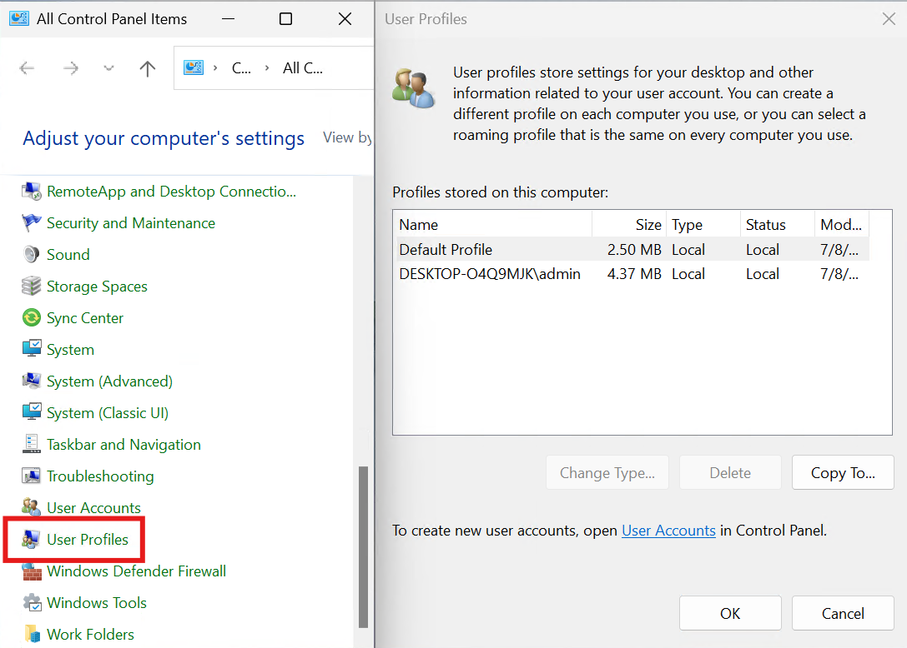

# Control Panel User Profiles

This repo will create a new Control Panel icon that opens User Profiles.

## Instructions

In the repo, find the latest release and download the `user-profiles-cpl.reg` file

Launch it and check the `Control Panel`